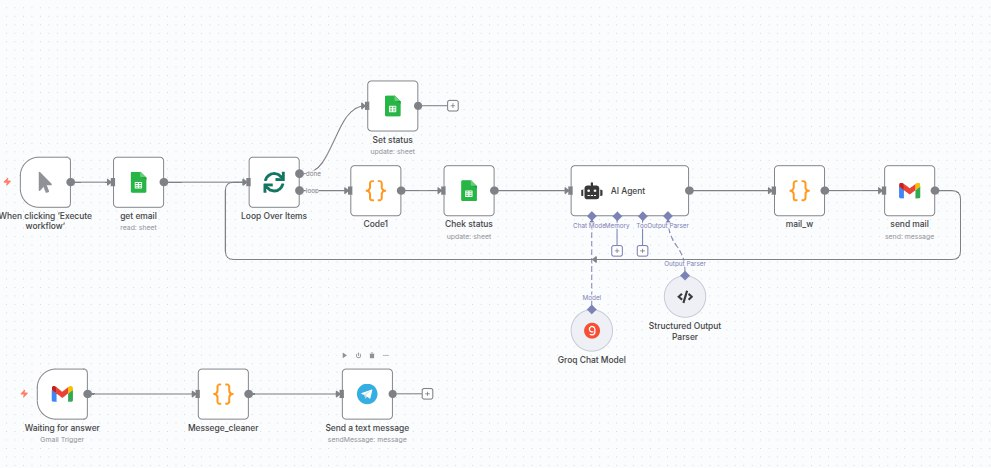

  

# ✉️ AI-Powered Email Generator & Sender (n8n Workflow)

This n8n workflow takes email topics or prompts from a Google Sheet, generates full emails using an LLM (Groq API or OpenAI), and sends them automatically via SMTP.  
Perfect for automating personalized email campaigns with zero manual writing.

## 🔧 Use Case

Generate and send AI-written emails to:

- 📨 Cold prospects (B2B outreach)
- 📬 Newsletter subscribers
- 🎯 Nurture leads or clients
- 🤖 Respond automatically based on dynamic input

## 🧠 How It Works

1. **Prompt Input**  
   Email subjects or custom prompts are provided in a Google Sheet or via webhook.

2. **Text Generation (AI)**  
   Each prompt is sent to a language model (e.g., Groq with LLaMA3 or OpenAI) using an API call. The model returns a full email body.

3. **Email Formatting**  
   The result is formatted (Markdown, HTML, or plain text) and passed to the email node.

4. **Email Sending**  
   The final email is sent via SMTP, Gmail API, or another mail service.

## 🛠 Tech Stack

- [n8n](https://n8n.io/)
- Groq API or OpenAI (LLM)
- Google Sheets or Webhook
- SMTP / Gmail
- Markdown or HTML formatting

## 📁 Example Flow Nodes

- Google Sheets (read subjects/prompts)
- Function (prepare prompt + formatting)
- HTTP Request (Groq or OpenAI)
- SMTP Email node
- Error handler (optional)

---

## ✨ Features

- 🔄 Dynamic loop: supports batch or single email mode  
- 📌 Prompt customization: each row can have its own prompt  
- ⚠️ Failsafe: handles API or SMTP failures gracefully  
- 📤 Ready for scale: easily connects with CRM, Airtable, etc.

---

## 📬 Example Output

Prompt: “Follow-up email after product demo”

→ Subject: Thank you for your time today
→ Body: "Hi John, thank you for joining our product demo. As promised, here's a quick recap..."
→ Status: ✅ Sent via SMTP

## 📬 Contact

Created by [Serhii Litus](https://www.upwork.com/freelancers/~016b54c2291f96bd7d)  
Let AI write and send your emails while you focus on closing deals 🔥
